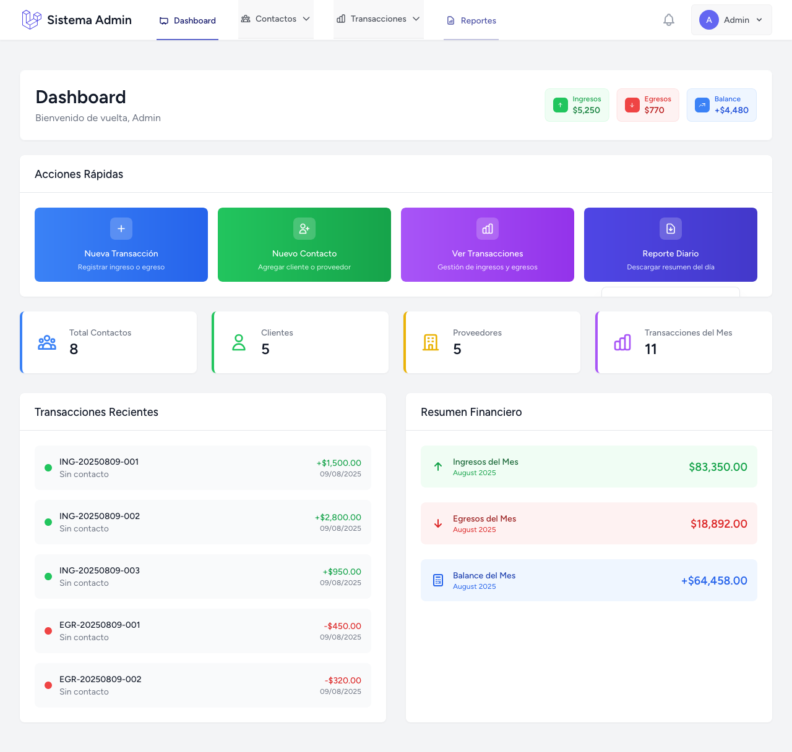
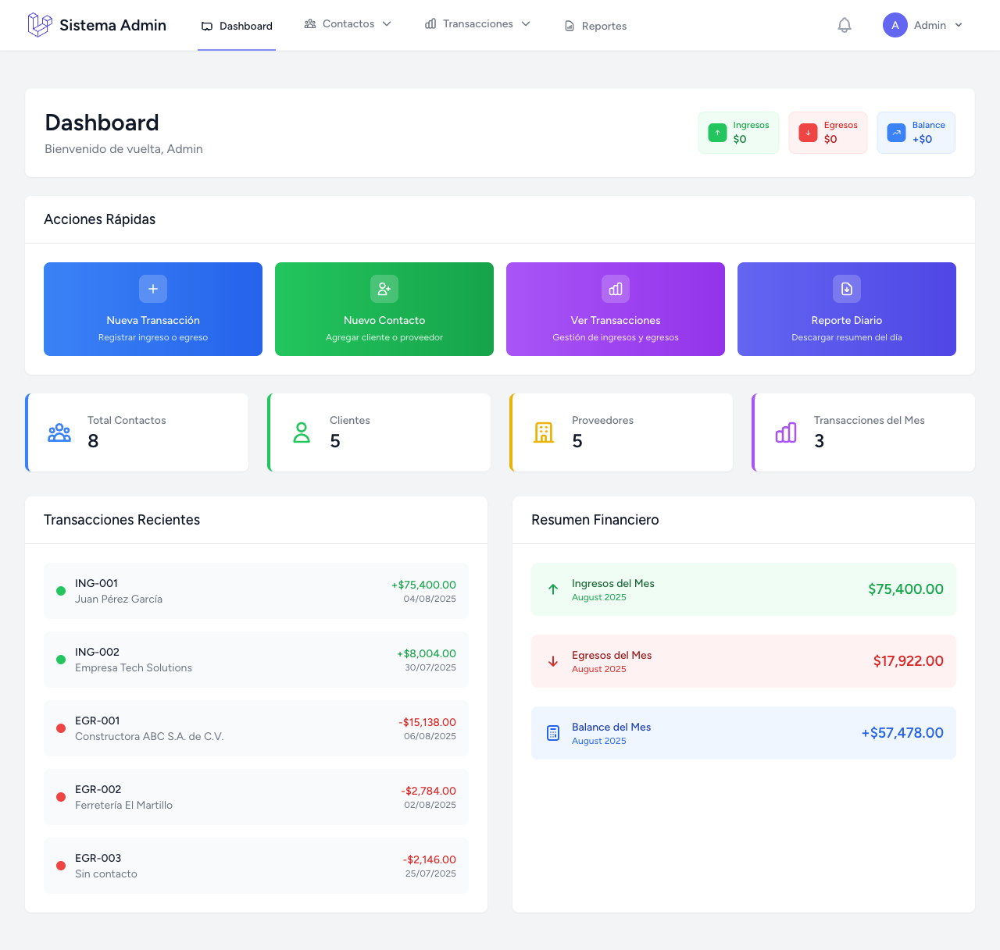
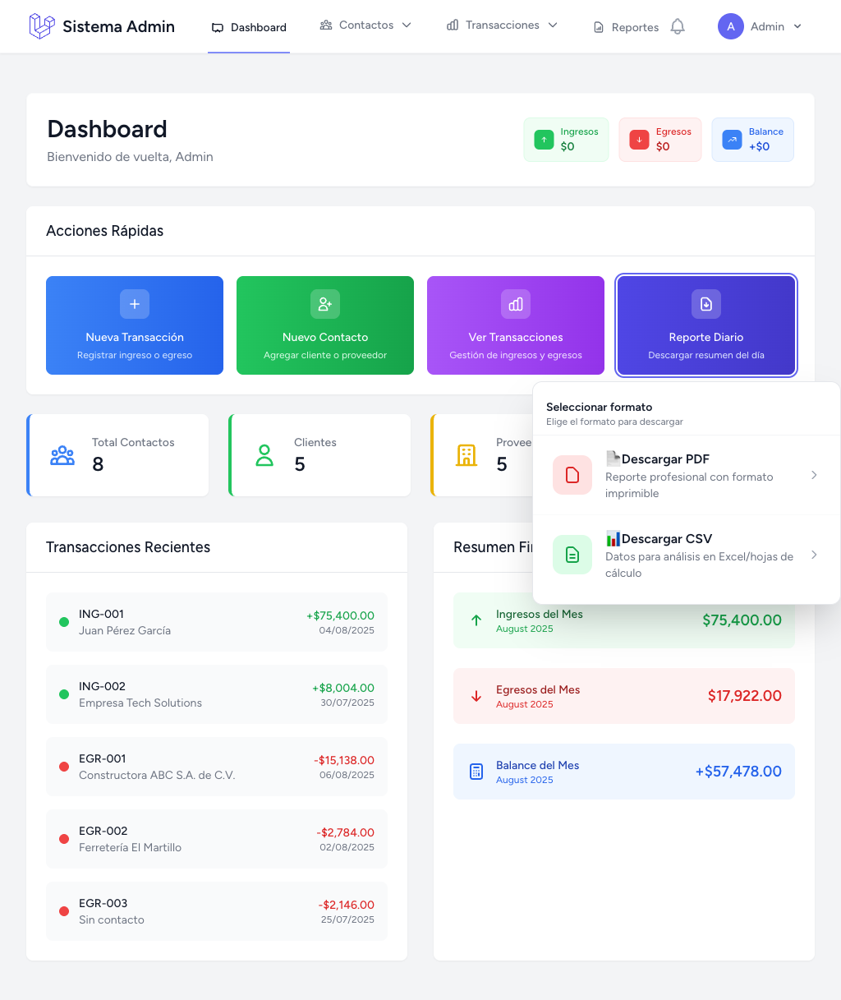

# 📊 Sistema Administrativo

<div align="center">
  
  
  
  [](https://laravel.com)
  [](https://php.net)
  [](https://tailwindcss.com)
  [](https://playwright.dev)
  
  [](https://github.com/ederjgb94/sistema-administrativo/releases/tag/v1.0.0)
  [](LICENSE)
  [](CONTRIBUTING.md)

</div>

## 🚀 Sobre el Proyecto

**Sistema Administrativo** es una aplicación web moderna y robusta construida con Laravel 12, diseñada para gestionar contactos, transacciones y generar reportes con una interfaz elegante y responsiva.

### ✨ Características Principales

- 🎨 **UI/UX Moderna**: Con Tailwind CSS
- 📊 **Exportación PDF**: Generación completa de reportes
- 👤 **Gestión de Usuarios**: Sistema de autenticación y perfiles
- 📱 **Totalmente Responsivo**: Optimizado para móviles y tablets
- 🧪 **Testing Automatizado**: Cobertura completa con Playwright
- 🔍 **Búsqueda Avanzada**: Filtros dinámicos y búsqueda
- 📈 **Dashboard Interactivo**: Estadísticas y métricas

## 📷 Capturas de Pantalla

<div align="center">
  
  ### 🏠 Dashboard Principal
  
  
  ### 👤 Dashboard Usuario Autenticado
  
  
  ### 📱 Diseño Responsivo
  
  
</div>

## 🛠️ Tecnologías Utilizadas

### Backend
- **Laravel 12** - Framework PHP moderno
- **PHP 8.2+** - Lenguaje de programación
- **SQLite/MySQL** - Base de datos
- **DomPDF** - Generación de PDF

### Frontend
- **Tailwind CSS 3** - Framework CSS utility-first
- **Alpine.js** - Framework JavaScript ligero
- **Vite** - Build tool moderno
- **Blade Templates** - Motor de plantillas de Laravel

### Testing & QA
- **Playwright** - Testing end-to-end
- **PHPUnit** - Testing unitario
- **Laravel Testing** - Testing de aplicación

## 🚀 Instalación Rápida

### Prerrequisitos
- PHP 8.2 o superior
- Composer
- Node.js & npm
- Git

### 1. Clonar el Repositorio
```bash
git clone https://github.com/ederjgb94/sistema-administrativo.git
cd sistema-administrativo
```

### 2. Instalación Automática
```bash
chmod +x setup.sh
./setup.sh
```

### 3. Configuración Manual (Alternativa)
```bash
# Instalar dependencias PHP
composer install

# Instalar dependencias Node.js
npm install

# Copiar archivo de entorno
cp .env.example .env

# Configurar base de datos en .env (SQLite por defecto)
# DB_CONNECTION=sqlite
# DB_DATABASE=/ruta/completa/al/database/database.sqlite

# Generar key de aplicación
php artisan key:generate

# Crear enlace simbólico para storage
php artisan storage:link

# Ejecutar migraciones y seeders
php artisan migrate --seed

# Compilar assets
npm run build

# Instalar browsers para testing (opcional)
npx playwright install chromium

# Iniciar servidor de desarrollo
php artisan serve
```

### ⚙️ Configuración Adicional

#### Variables de Entorno Importantes
Asegúrate de configurar en tu archivo `.env`:

```env
APP_NAME="Sistema Administrativo"
APP_ENV=local
APP_KEY=base64:tu_key_generada
APP_DEBUG=true
APP_URL=http://localhost:8000

DB_CONNECTION=sqlite
DB_DATABASE=/ruta/completa/database.sqlite

# Para producción, configura también:
# MAIL_MAILER=smtp
# RESEND_API_KEY=your_resend_key_here
```

## 🎯 Funcionalidades

### 📊 Gestión de Contactos
- ✅ CRUD completo de contactos
- ✅ Búsqueda y filtrado avanzado
- ✅ Exportación a PDF
- ✅ Importación masiva

### 💰 Gestión de Transacciones
- ✅ Registro de transacciones
- ✅ Múltiples métodos de pago
- ✅ Reportes detallados
- ✅ Estadísticas financieras

### 👤 Sistema de Usuarios
- ✅ Autenticación segura
- ✅ Gestión de perfiles
- ✅ Control de acceso
- ✅ Verificación de email

### 📱 UI/UX
- ✅ Diseño responsivo
- ✅ Modo oscuro/claro
- ✅ Componentes interactivos
- ✅ Animaciones suaves

## 🧪 Testing

### Ejecutar Tests
```bash
# Tests PHP (PHPUnit)
php artisan test

# Tests E2E (Playwright)
npx playwright test

# Tests con interfaz gráfica
npx playwright test --ui
```

### Cobertura de Testing
- ✅ Tests unitarios para modelos
- ✅ Tests de integración para API
- ✅ Tests E2E para flujos completos
- ✅ Tests de UI/UX

## 📚 Documentación

### Estructura del Proyecto
```
sistema-administrativo/
├── app/                    # Aplicación Laravel
│   ├── Http/Controllers/   # Controladores
│   ├── Models/            # Modelos Eloquent
│   └── View/Components/   # Componentes Blade
├── resources/
│   ├── views/             # Plantillas Blade
│   ├── css/               # Estilos
│   └── js/                # JavaScript
├── tests/                 # Tests automatizados
├── playwright.config.js   # Configuración Playwright
└── setup.sh              # Script de instalación
```

### Comandos Útiles
```bash
# Desarrollo
php artisan serve              # Servidor de desarrollo
npm run dev                    # Compilar assets (desarrollo)
npm run build                  # Compilar assets (producción)

# Base de datos
php artisan migrate            # Ejecutar migraciones
php artisan db:seed           # Ejecutar seeders
php artisan migrate:fresh --seed  # Resetear y poblar DB

# Storage y Cache
php artisan storage:link       # Crear enlace simbólico para storage
php artisan config:cache       # Cachear configuración (producción)
php artisan route:cache        # Cachear rutas (producción)
php artisan view:cache         # Cachear vistas (producción)

# Testing
php artisan test              # Tests PHP
npx playwright test           # Tests E2E
npx playwright test --ui      # Tests E2E con interfaz
npx playwright test --headed  # Tests E2E con browser visible

# Mantenimiento
php artisan queue:work         # Procesar colas (si aplica)
php artisan schedule:work      # Ejecutar tareas programadas (si aplica)
```

## 🤝 Contribuir

¡Las contribuciones son bienvenidas! Por favor:

1. Fork el proyecto
2. Crea tu rama de feature (`git checkout -b feature/AmazingFeature`)
3. Commit tus cambios (`git commit -m 'Add: AmazingFeature'`)
4. Push a la rama (`git push origin feature/AmazingFeature`)
5. Abre un Pull Request

## 📝 Changelog

### v1.0.0 (2025-08-13)
- 🚀 **Lanzamiento inicial** del Sistema Administrativo
- ✨ **Gestión completa** de contactos y transacciones
- 🎨 **UI/UX moderna** con diseño Apple TV style
- 📊 **Exportación PDF** completa
- 🧪 **Testing comprehensivo** con Playwright
- 📱 **Diseño totalmente responsivo**

## 📄 Licencia

Este proyecto está bajo la Licencia MIT. Ver el archivo [LICENSE](LICENSE) para más detalles.

## 👨‍💻 Autor

**Eder Jahir González Bravo**
- GitHub: [@ederjgb94](https://github.com/ederjgb94)

---

<div align="center">
  
  **⭐ Si te gusta este proyecto, ¡dale una estrella en GitHub! ⭐**
  
  Hecho con ❤️ usando Laravel y Tailwind CSS
  
</div>
